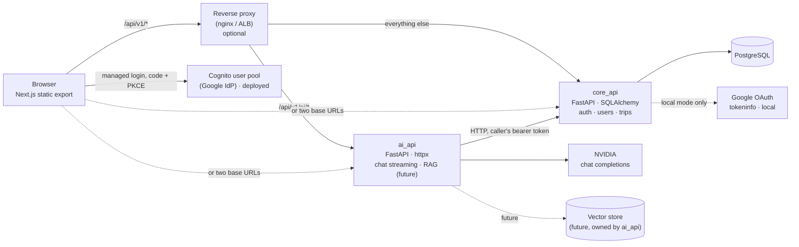
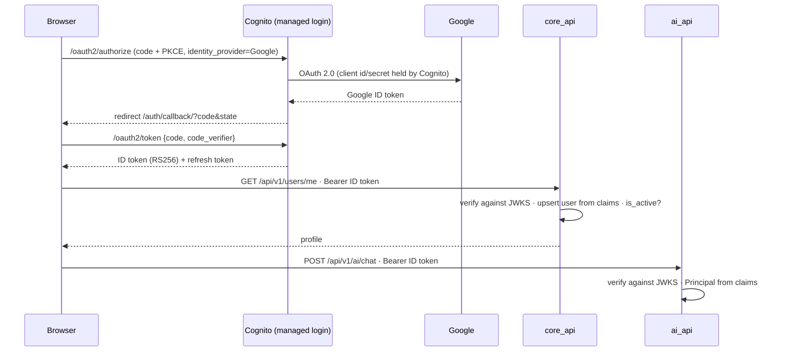
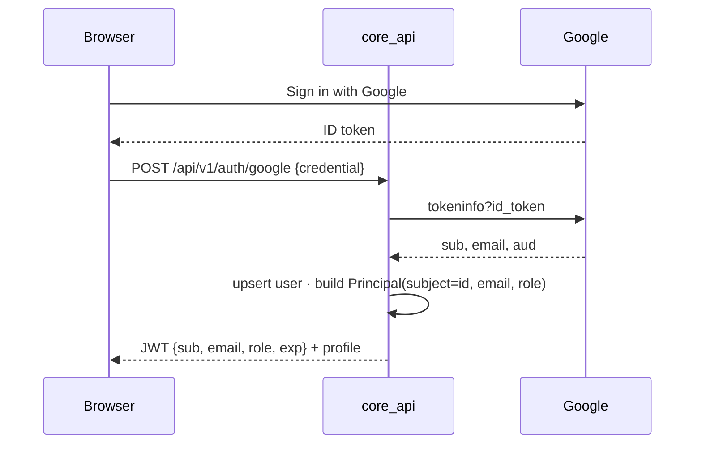
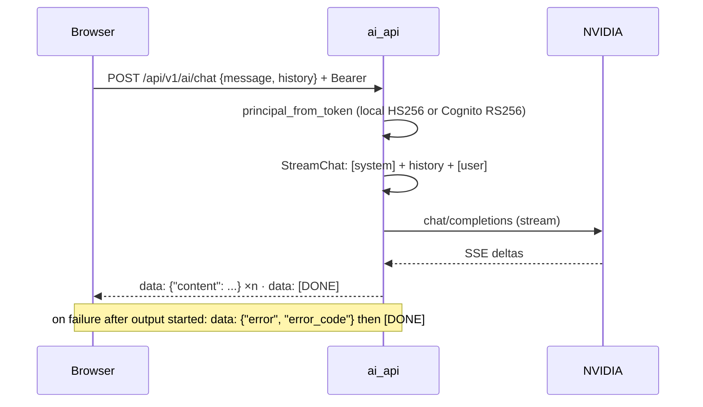
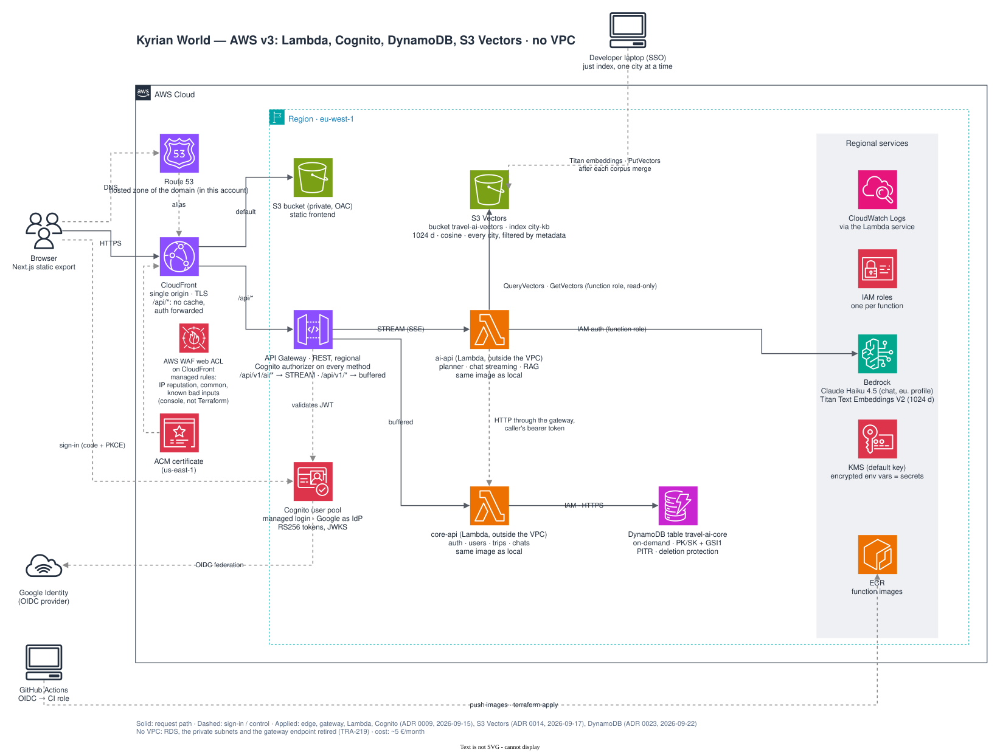

# Architecture overview

Travel AI World is a static Next.js frontend and two FastAPI services that share nothing at
runtime except the way they verify bearer tokens. See [ADR 0001](adr/0001-backend-split.md) for why.

## Containers

| Component | Owns | Never touches |
|---|---|---|
| `core_api` | users, trips and their children; account upsert and revocation; local-mode sign-in and token issuing | LLM providers |
| `ai_api` | prompts, providers, retrieval, streaming | the relational database, ORM models |
| `travel_common` | `Principal`, settings base, domain errors, token verification (local HS256, Cognito RS256), app factory | anything used by one service only |

Calls go in one direction only: `ai_api → core_api`. `core_api` works with `ai_api` down.

## Code layout per service

- `core_api` is **N-tier**: `api → services → repositories → models`. Generic `BaseRepository`
  and `BaseService`; endpoints are thin; services raise domain errors; a single handler maps them
  to HTTP. `Trip` is the aggregate root: its children are nested under `/trips/{trip_id}/...` and
  authorised once at the boundary ([ADR 0005](adr/0005-trip-aggregate-nested-resources.md)).
  Entities own their invariants (`check_invariants()`); one transaction per request
  (`unit_of_work`) commits on success and rolls back on any error.
- `ai_api` is **ports and adapters**: `domain` (types + Protocols) ← `application` (use cases) ←
  `infrastructure` (NVIDIA, SSE, core_api client) ← `api` (wiring). Swapping the LLM provider or
  adding a retriever touches only `infrastructure/` and `api/deps.py`.

Two styles on purpose: a CRUD service is best served by layers; an integration-heavy service by
ports. Each service's `AGENTS.md` documents its own.

## Identity

Two token issuers, one contract, selected by `AUTH_MODE` in both services
([ADR 0009](adr/0009-lambda-cognito-budget.md)): `travel_common.security.verify_token` yields
`Claims(subject, email, role, name, picture)`, endpoints see a `Principal(subject, email, role)`,
and `core_api` extends it with the account id (`AccountPrincipal`) after its database check.

**Deployed (`AUTH_MODE=cognito`).** The Amazon Cognito user pool signs people in with Google and
issues RS256 ID tokens; the services verify them offline against the pool's JWKS, which Terraform
passes as configuration. No token is issued by our code and no secret is shared between services.

**Local (`AUTH_MODE=local`, the default).** The Google Identity Services button gives the browser
a Google ID token; `core_api` verifies it with Google's `tokeninfo`, upserts the account and issues
its own HS256 token with `SECRET_KEY`, shared with `ai_api`.

In both modes:

- `core_api` verifies the token **and** checks the account in the database on every request:
  a deactivated user is cut off immediately. In Cognito mode the row is upserted from the claims
  on first sight and the `admin` role mirrors the pool's `admin` group; in local mode the database
  owns the role (`PATCH /users/{id}/role`).
- `ai_api` verifies the token only (stateless). A deactivated user can keep chatting until the
  token expires (60 min). See [ADR 0002](adr/0002-auth-between-services.md) (superseded for the
  issuer, still the rule for the boundary).

## Chat

Wire format is fixed by `ai_api/infrastructure/sse.py` and consumed by `src/frontend/src/services/chat.ts`.

## Service-to-service calls

When `ai_api` must persist something (a generated itinerary), it calls `core_api` **as the user**:
it forwards the same bearer token, so `core_api` applies the same permissions it applies to the
browser. No service secret exists today; add an `INTERNAL_API_KEY` + `/internal/*` router only when
a job must act without a user (RAG ingestion).

## Contracts

Pydantic schemas are the source of truth. `just contracts` exports `docs/api/*.openapi.json` and
regenerates `src/frontend/src/types/generated/*.ts`; CI fails on drift.

## Deployment shapes

| Environment | Origin(s) | Frontend env |
|---|---|---|
| Local `just dev-*` | `:8000` core, `:8001` ai | `NEXT_PUBLIC_API_URL`, `NEXT_PUBLIC_AI_API_URL` |
| Docker Compose | nginx `:8080` | `NEXT_PUBLIC_API_URL` only |
| AWS v3 (CloudFront → S3 + API Gateway → Lambda, `infra/aws/`) | one CloudFront domain | `NEXT_PUBLIC_API_URL=https://<domain>` (same origin) + `NEXT_PUBLIC_COGNITO_*` |
| GCP (two Cloud Run) | two URLs | both variables |

See [ADR 0003](adr/0003-frontend-two-base-urls.md) and the [deploy runbook](../runbooks/deploy.md).

### AWS target (v3)

[`aws-architecture.drawio.svg`](aws-architecture.drawio.svg) is a draw.io diagram (official
"AWS Architecture" shape library) saved as an SVG with the diagram XML embedded: GitHub renders
it as is, and it is edited in place with the VS Code draw.io extension (installed by the
devcontainer) or at app.diagrams.net (File → Open). No build step. Decisions, cost estimate and
the order of work: [ADR 0009](adr/0009-lambda-cognito-budget.md) (Lambda, Cognito, no NAT; the
edge and gateway decisions come from [ADR 0008](adr/0008-aws-architecture-v2-edge-and-gateway.md)).
`infra/aws/` is this shape ([README](../../infra/aws/README.md)); Bedrock (TRA-122) and the
`pgvector` database (TRA-123) are the parts still to come.

## Known gaps (tracked)

- No rate limiting or per-user AI quotas; add at the proxy/gateway when needed.
- The trip viewer (`/trip/[id]`) still prerenders the fixtures served by
  `src/frontend/src/services/trips.ts` (in the backend's shape, mapped by `toTrip`); the dashboard
  already lists the signed-in user's trips from `core_api` (`listTrips`, client-side, as decided in
  [ADR 0006](adr/0006-frontend-trip-view-model.md)).
