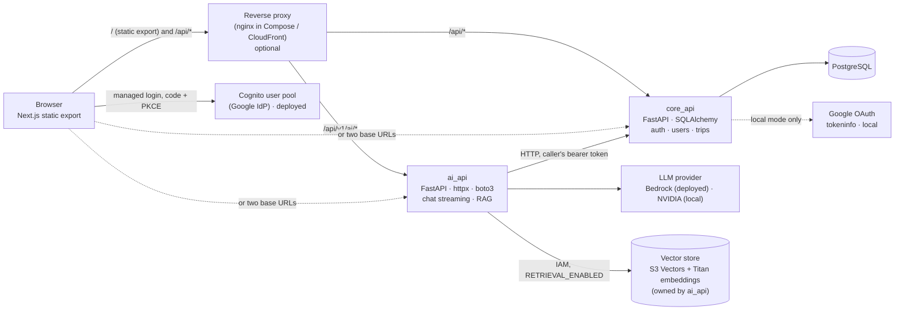
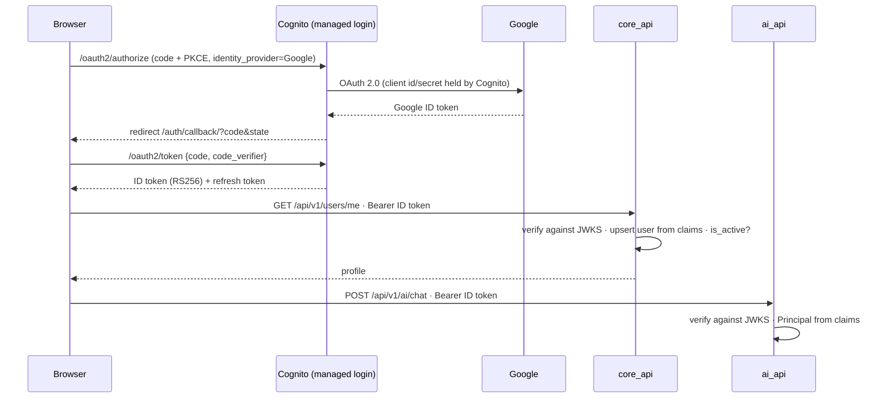
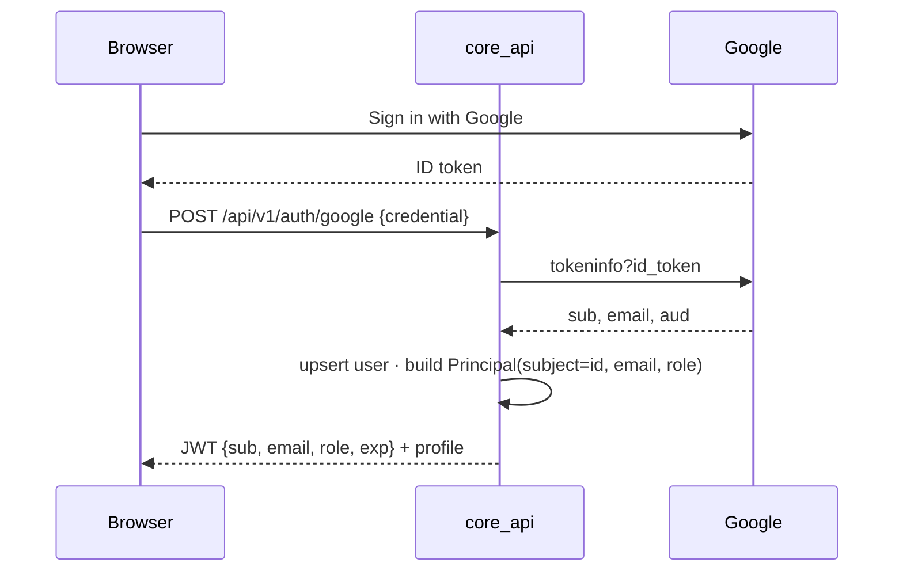
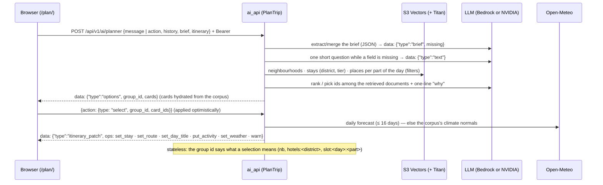

# Architecture overview

Travel AI World is a static Next.js frontend and two FastAPI services that share nothing at
runtime except the way they verify bearer tokens. See [ADR 0001](adr/0001-backend-split.md) for why.

## Containers



| Component | Owns | Never touches |
|---|---|---|
| `core_api` | users, trips and their children; account upsert and revocation; local-mode sign-in and token issuing | LLM providers |
| `ai_api` | prompts, providers, retrieval, streaming | the relational database, ORM models |
| `travel_common` | `Principal`, settings base, domain errors, token verification (local HS256, Cognito RS256), app factory | anything used by one service only |

Calls go in one direction only: `ai_api → core_api`. `core_api` works with `ai_api` down.

## Code layout per service

- `core_api` is **N-tier**: `api → services → repositories → models`. Generic `BaseRepository`
  and `BaseService`; endpoints are thin; services raise domain errors; a single handler maps them
  to HTTP. `Trip` is the aggregate root: its children are nested under `/trips/{trip_id}/...` and
  authorised once at the boundary ([ADR 0005](adr/0005-trip-aggregate-nested-resources.md)).
  Entities own their invariants (`check_invariants()`); one transaction per request
  (`unit_of_work`) commits on success and rolls back on any error.
- `ai_api` is **ports and adapters**: `domain` (types + Protocols) ← `application` (use cases) ←
  `infrastructure` (NVIDIA, SSE, core_api client) ← `api` (wiring). Swapping the LLM provider or
  adding a retriever touches only `infrastructure/` and `api/deps.py`.

Two styles on purpose: a CRUD service is best served by layers; an integration-heavy service by
ports. Each service's `AGENTS.md` documents its own.

## Identity

Two token issuers, one contract, selected by `AUTH_MODE` in both services
([ADR 0009](adr/0009-lambda-cognito-budget.md)): `travel_common.security.verify_token` yields
`Claims(subject, email, role, name, picture)`, endpoints see a `Principal(subject, email, role)`,
and `core_api` extends it with the account id (`AccountPrincipal`) after its database check.

**Deployed (`AUTH_MODE=cognito`).** The Amazon Cognito user pool signs people in with Google and
issues RS256 ID tokens; the services verify them offline against the pool's JWKS, which Terraform
passes as configuration. No token is issued by our code and no secret is shared between services.



**Local (`AUTH_MODE=local`, the default).** The Google Identity Services button gives the browser
a Google ID token; `core_api` verifies it with Google's `tokeninfo`, upserts the account and issues
its own HS256 token with `SECRET_KEY`, shared with `ai_api`.



In both modes:

- `core_api` verifies the token **and** checks the account in the database on every request:
  a deactivated user is cut off immediately. In Cognito mode the row is upserted from the claims
  on first sight and the `admin` role mirrors the pool's `admin` group; in local mode the database
  owns the role (`PATCH /users/{id}/role`).
- `ai_api` verifies the token only (stateless). A deactivated user can keep chatting until the
  token expires (60 min). See [ADR 0002](adr/0002-auth-between-services.md) (superseded for the
  issuer, still the rule for the boundary).

## Chat

```mermaid
sequenceDiagram
    participant B as Browser
    participant A as ai_api
    participant V as S3 Vectors (+ Titan)
    participant N as LLM (Bedrock or NVIDIA)
    participant C as core_api
    B->>A: POST /api/v1/ai/chat {message, history, thread_id?} + Bearer
    A->>A: principal_from_token (local HS256 or Cognito RS256)
    A->>V: embed the question (Titan V2) · QueryVectors top-k
    V-->>A: passages + metadata (skipped if RETRIEVAL_ENABLED is off or the store fails)
    A->>A: StreamChat: [system] + [system: passages] + history + [user]
    A->>N: converse_stream (Bedrock) or chat/completions (NVIDIA)
    N-->>A: SSE deltas
    A-->>B: data: {"content": ...} ×n
    A->>C: POST /chat-threads/… question + answer (sources, model, tokens, latency)
    A-->>B: data: {"thread_id": ...} · data: [DONE]
    Note over A,B: on failure after output started: data: {"error", "error_code"} then [DONE]
    Note over A,C: recording failures are logged only; the answer is already delivered
```

Retrieval ([ADR 0014](adr/0014-vector-store-s3-vectors.md)) embeds only the question; the passages
reach the model as a second system turn and the recorded answer as its `sources`. The index is
filled out of band by `just index` from the corpus committed under `tools/city_corpus/data/`.

Wire format is fixed by `ai_api/infrastructure/sse.py` and consumed by `src/frontend/src/services/chat.ts`.
Conversations are stored by `core_api` ([ADR 0013](adr/0013-chat-conversations-in-core-api.md)):
`ai_api` keeps no state and reaches no database.

## Planner

The planner page (`/plan/`) talks to `POST /api/v1/ai/planner`, the typed successor of the chat
stream: SSE v2 ([ADR 0015](adr/0015-planner-sse-v2-stateless-orchestration.md)), one JSON event per
`data:` line (`text`, `brief`, `options`, `itinerary_patch`, `error`) then `[DONE]`, with the models
generated for both sides by `just contracts`.



Every card is a retrieved corpus document (`application/cards.py`); ids the model returns that were
not retrieved are dropped, prices are tiers, flights a prefilled search link (`static_flight_search.py`),
and `application/validate.py` adds `warn` ops (distance, load per pace, closed that weekday, a price
in model text). Without the route (a 404) or without an `ai_api` URL the page plays the recorded
session in `src/frontend/src/data/planner-demo/session.ts` behind a demo banner (TRA-158); the same
session is the test double for the page.

## Service-to-service calls

When `ai_api` must persist something (a generated itinerary), it calls `core_api` **as the user**:
it forwards the same bearer token, so `core_api` applies the same permissions it applies to the
browser. No service secret exists today; add an `INTERNAL_API_KEY` + `/internal/*` router only when
a job must act without a user (RAG ingestion).

## Contracts

Pydantic schemas are the source of truth. `just contracts` exports `docs/api/*.openapi.json` and
regenerates `src/frontend/src/types/generated/*.ts`; CI fails on drift.

## Deployment shapes

| Environment | Origin(s) | Frontend env |
|---|---|---|
| Local `just dev-*` | `:8000` core, `:8001` ai | `NEXT_PUBLIC_API_URL`, `NEXT_PUBLIC_AI_API_URL` |
| Docker Compose (`just stack-up`) | nginx `:8080`: the export at `/`, the APIs at `/api/*` (same origin, like AWS) | `NEXT_PUBLIC_API_URL=http://localhost:8080` only, set by the recipe |
| AWS v3 (CloudFront → S3 + API Gateway → Lambda, `infra/aws/`) | one CloudFront domain | `NEXT_PUBLIC_API_URL=https://<domain>` (same origin) + `NEXT_PUBLIC_COGNITO_*` |
| GCP (two Cloud Run) | two URLs | both variables |

See [ADR 0003](adr/0003-frontend-two-base-urls.md) and the [deploy runbook](../runbooks/deploy.md).

### AWS target (v3)


[`aws-architecture.drawio.svg`](aws-architecture.drawio.svg) is a draw.io diagram (official
"AWS Architecture" shape library) saved as an SVG with the diagram XML embedded: GitHub renders
it as is, and it is edited in place with the VS Code draw.io extension (installed by the
devcontainer) or at app.diagrams.net (File → Open). No build step. Decisions, cost estimate and
the order of work: [ADR 0009](adr/0009-lambda-cognito-budget.md) (Lambda, Cognito, no NAT; the
edge and gateway decisions come from [ADR 0008](adr/0008-aws-architecture-v2-edge-and-gateway.md)).
`infra/aws/` is this shape ([README](../../infra/aws/README.md)), with the chat on Bedrock
(TRA-122, `LLM_PROVIDER`) and the vector store on **Amazon S3 Vectors**
([ADR 0014](adr/0014-vector-store-s3-vectors.md)): the `pgvector` database of TRA-123 cannot be
reached from `ai_api`, outside the VPC, and S3 Vectors needs no endpoint of its own. The retriever
that reads it is TRA-152; the [vector store spike](vector-store-spike.md) (TRA-151) measured Qdrant
against it and kept S3 Vectors.

## Known gaps (tracked)

- No rate limiting or per-user AI quotas; add at the proxy/gateway when needed.
