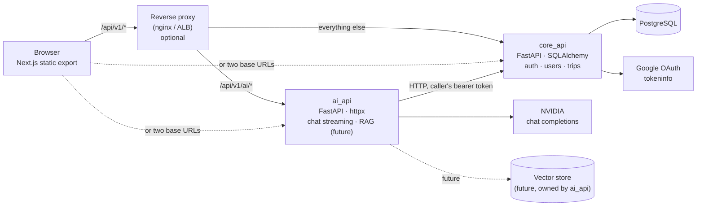
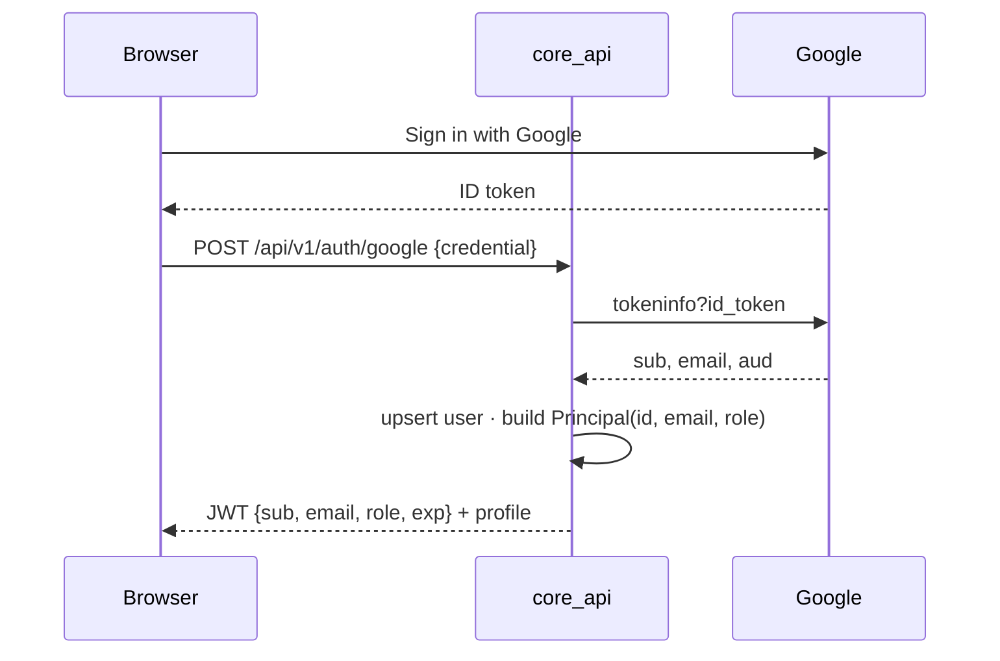
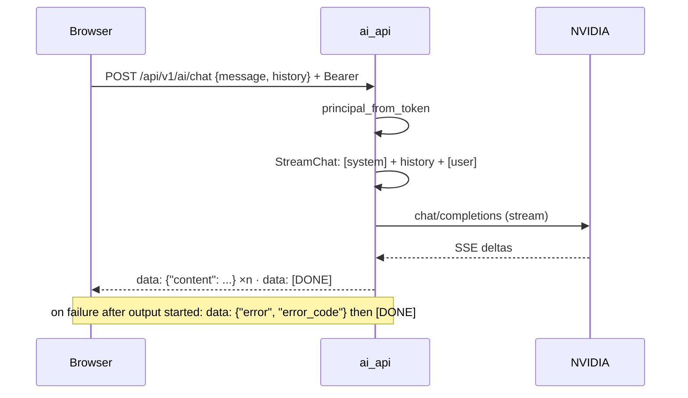

# Architecture overview

Travel AI World is a static Next.js frontend and two FastAPI services that share nothing at
runtime except a JWT signing key. See [ADR 0001](adr/0001-backend-split.md) for why.

## Containers

| Component | Owns | Never touches |
|---|---|---|
| `core_api` | users, trips and their children; Google sign-in; JWT issuing | LLM providers |
| `ai_api` | prompts, providers, retrieval, streaming | the relational database, ORM models |
| `travel_common` | `Principal`, settings base, domain errors, JWT codec, app factory | anything used by one service only |

Calls go in one direction only: `ai_api → core_api`. `core_api` works with `ai_api` down.

## Code layout per service

- `core_api` is **N-tier**: `api → services → repositories → models`. Generic `BaseRepository`
  and `BaseService`; endpoints are thin; services raise domain errors; a single handler maps them
  to HTTP. `Trip` is the aggregate root: its children are nested under `/trips/{trip_id}/...` and
  authorised once at the boundary ([ADR 0005](adr/0005-trip-aggregate-nested-resources.md)).
  Entities own their invariants (`check_invariants()`); one transaction per request
  (`unit_of_work`) commits on success and rolls back on any error.
- `ai_api` is **ports and adapters**: `domain` (types + Protocols) ← `application` (use cases) ←
  `infrastructure` (NVIDIA, SSE, core_api client) ← `api` (wiring). Swapping the LLM provider or
  adding a retriever touches only `infrastructure/` and `api/deps.py`.

Two styles on purpose: a CRUD service is best served by layers; an integration-heavy service by
ports. Each service's `AGENTS.md` documents its own.

## Identity

The JWT carries the whole `Principal`, so:

- `core_api` verifies the signature **and** checks the account in the database (revocation is immediate).
- `ai_api` verifies the signature only (stateless). A deactivated user can keep chatting until the
  token expires (60 min). See [ADR 0002](adr/0002-auth-between-services.md).

## Chat

Wire format is fixed by `ai_api/infrastructure/sse.py` and consumed by `src/frontend/src/services/chat.ts`.

## Service-to-service calls

When `ai_api` must persist something (a generated itinerary), it calls `core_api` **as the user**:
it forwards the same bearer token, so `core_api` applies the same permissions it applies to the
browser. No service secret exists today; add an `INTERNAL_API_KEY` + `/internal/*` router only when
a job must act without a user (RAG ingestion).

## Contracts

Pydantic schemas are the source of truth. `just contracts` exports `docs/api/*.openapi.json` and
regenerates `src/frontend/src/types/generated/*.ts`; CI fails on drift.

## Deployment shapes

| Environment | Origin(s) | Frontend env |
|---|---|---|
| Local `just dev-*` | `:8000` core, `:8001` ai | `NEXT_PUBLIC_API_URL`, `NEXT_PUBLIC_AI_API_URL` |
| Docker Compose | nginx `:8080` | `NEXT_PUBLIC_API_URL` only |
| AWS (ALB path rule) | one ALB | `NEXT_PUBLIC_API_URL` only |
| GCP (two Cloud Run) | two URLs | both variables |

See [ADR 0003](adr/0003-frontend-two-base-urls.md) and the [deploy runbook](../runbooks/deploy.md).

## Known gaps (tracked)

- No rate limiting or per-user AI quotas; add at the proxy/gateway when needed.
- `src/frontend/src/services/trips.ts` still serves mock data.
